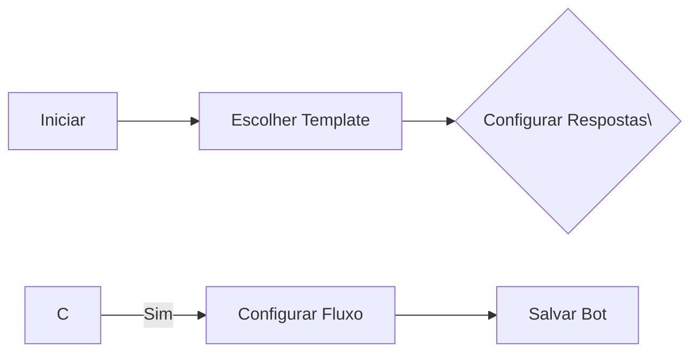
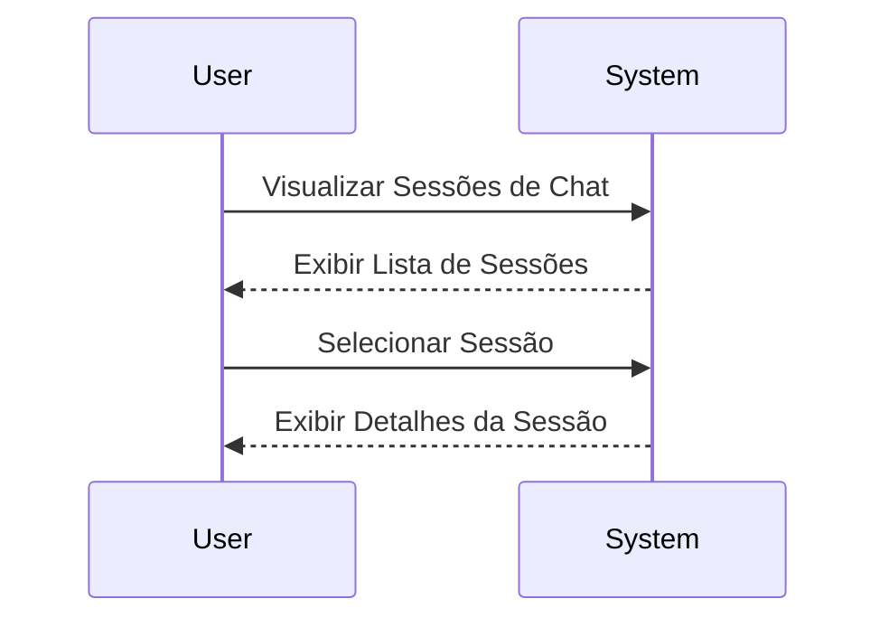

# Documentação funcional

## Visão geral das funcionalidades
O Chat Bot Builder Client é uma aplicação projetada para permitir que os usuários criem, gerenciem e personalizem bots de conversa. Esta ferramenta facilita a automação de interações em plataformas de mensagens, melhorando a eficiência e a capacidade de resposta para empresas e serviços. 

## Funcionalidade 1: Criação de Bots
Os usuários podem criar bots personalizados, determinando as respostas automáticas e as interações que estes devem realizar. Esta funcionalidade permite que os criadores de bot definam lógicas de fluxo de conversação e personalizem a experiência do usuário.

### Diagrama de fluxo


### Permissões
- **Administrador**: Pode criar, editar e excluir bots.
- **Usuário Padrão**: Pode criar e editar bots, mas não excluir.

## Funcionalidade 2: Gerenciamento de Sessões de Chat
Esta funcionalidade permite visualizar e gerenciar sessões de chat em andamento ou encerradas. Os gerentes podem avaliar o desempenho do bot e as respostas dos usuários.

### Diagrama de sequência


### Permissões
- **Administrador**: Acesso completo a todas as sessões.
- **Usuário Padrão**: Pode visualizar apenas suas próprias sessões.

## Funcionalidade 3: Análise e Relatórios
O sistema oferece análise de dados e relatórios sobre o desempenho dos bots, como a quantidade de interações, sucesso dos objetivos e satisfação do usuário.

### Diagrama de requerimentos
```mermaid
requirementDiagram
requirement analysis_req \{
  id: 1
  text: O sistema deve gerar relatórios diários de desempenho dos bots.
  risk: medium
  verifymethod: automated test
\}
element test_suite_analise \{
  type: manual test
\}
test_suite_analise - verifies -> analysis_req
```

### Permissões
- **Administrador**: Pode gerar e visualizar todos os relatórios.
- **Usuário Padrão**: Pode visualizar relatórios somente de seus próprios bots.

## Regras de negócios
- **Criação de Bot**: Cada bot deve pertencer a um domínio específico.
- **Sessão de Chat**: Uma sessão expira se inativa por mais de 30 minutos.
- **Relatórios de Performance**: Relatórios são gerados automaticamente ao final do dia.
- **Permissões de Usuário**: Usuários padrão possuem restrições de edição e exclusão de conteúdos não pertencentes a eles.

---

## Diagrama C4

### Diagrama de Contexto (Nível 1)
```mermaid
C4Context
title Diagrama de Contexto para o Sistema Chat Bot Builder Client
Enterprise_Boundary(b0, "Sistema Chat Bot") \{
  Person(admin, "Administrador", "Gerente dos Bots e Análises")
  Person(user, "Usuário Padrão", "Criadores e Gerentes de Bots")
  System(chat_bot_sys, "Chat Bot Builder System", "Sistema onde os bots são criados e gerenciados")

  Rel(admin, chat_bot_sys, "Usa")
  Rel(user, chat_bot_sys, "Usa")
\}
```

### Diagrama de Containers (Nível 2)
```mermaid
C4Container
title Diagrama de Container para o Sistema Chat Bot Builder

Container_Boundary(c1, "Chat Bot Builder") \{
    Container(ui_app, "Aplicação Web", "React", "Interface para criar e gerenciar bots")
    Container(api_backend, "API Backend", "Node.js", "Lógica de Negócios e Comunicação com banco de dados")
    ContainerDb(db, "Banco de Dados", "MongoDB", "Armazena dados dos bots e sessões")
\}

Rel(user, ui_app, "Usa", "HTTPS")
Rel(admin, ui_app, "Usa", "HTTPS")
Rel(ui_app, api_backend, "Usa", "REST API/HTTPS")
Rel(api_backend, db, "Ler/Escrever", "MongoDB Wire Protocol")

System_Ext(external_chat, "Plataformas de Mensagens", "WhatsApp, Messenger, etc.")
Rel(api_backend, external_chat, "Envia/Recebe Mensagens", "HTTP")
```

---

Esta documentação fornece uma visão abrangente das funcionalidades e arquitetura instalada no Chat Bot Builder Client, proporcionando às equipes interessadas uma compreensão clara e direta das capacidades e dos componentes do sistema.

## Como rodar

- Necessário estar conectado à VPN, caso precise se conectar ao MongoDB.

Execute o container do [docker](https://github.com/Octadesk-Tech/octadesk-system).
 
  **Abrir o Visual Studio**: Inicie o Visual Studio e abra o projeto ou solução que deseja executar.
  
  **Selecionar a Configuração**: No menu superior, escolha a configuração desejada (geralmente _Debug_ ) e o projeto de inicialização (caso sua solução tenha vários).
  
  **Identificar os Perfis**: No arquivo `Properties/launchSettings.json`, há seções chamadas `profiles`, onde cada perfil tem configurações específicas (como URLs, argumentos de linha de comando, etc.).
  
  **Executar o Projeto**: Clique no botão **"Iniciar Depuração"** (ícone verde com uma seta ou `F5`) para rodar o projeto com suporte de depuração, ou em **"Iniciar Sem Depuração"** (`Ctrl+F5`) para rodá-lo sem ferramentas de depuração.
   
  **Acompanhar a Saída**: O Visual Studio abrirá uma janela de saída ou o navegador (para projetos web), e você pode observar logs ou resultados na interface.

  **Obs**: Verificar se no lauchSetting.json está o endereço correto do Banco de Dados (com as senhas preenchidas), caso precise se conectar ao MongoDB.
