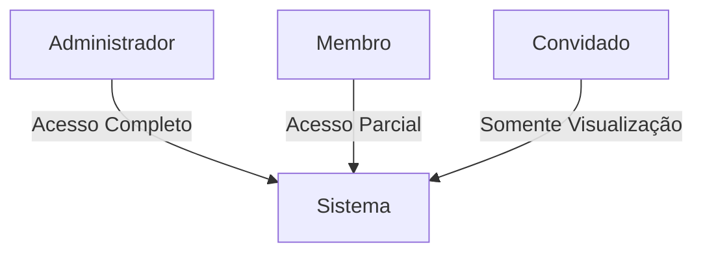
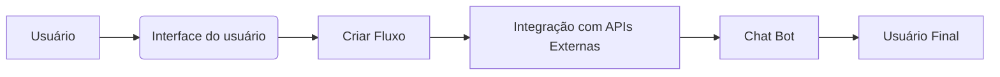
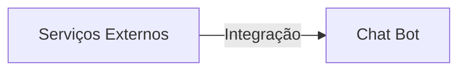
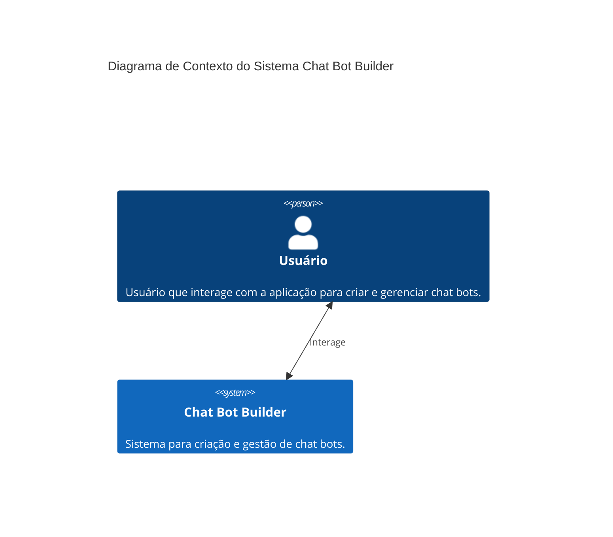

# Documentação funcional

## Visão geral das funcionalidades

O Chat Bot Builder Client é uma aplicação que permite aos usuários criar e gerenciar chatbots de forma eficiente. A principal funcionalidade é a criação de fluxos de conversação por meio de uma interface amigável, que atende às necessidades de negócios para automatização de atendimento ao cliente, captação de leads, entre outros. O sistema possui características modulares, suportando a integração com diversos serviços externos e oferecendo uma interface intuitiva para usuários leigos e profissionais.

## Funcionalidade 1: Gestão de usuários e permissões

### Descrição
A aplicação suporta diferentes tipos de usuários, cada um com permissões distintas em relação às operações que podem realizar. Os papéis incluem:

- **Administrador**: pode criar, editar e excluir todos os tipos de dados, bem como gerenciar configurações do sistema.
- **Membro**: pode criar e editar bots, mas com restrições em configurações globais do sistema.
- **Convidado**: tem acesso limitado somente para visualização, sem poder editar ou criar novos elementos.

### Diagrama


## Funcionalidade 2: Criação de fluxos de bot

### Descrição
Interface de criação de bot com opções de personalização de conversas, configuração de respostas automáticas e integração com APIs externas para enriquecer a experiência dos usuários finais.

### Diagrama


## Funcionalidade 3: Integração com serviços externos

### Descrição
O sistema permite integração com serviços de terceiros como Google Drive, Slack, e plataformas de e-mail, para ampliar a funcionalidade do chatbot com inclusão de dados externos.

### Diagrama


## Regras de negócios

### Regras de negócios implementadas
1. **Criação de Bot**: Apenas usuários com permissão de **Membro** ou superior podem criar ou editar bots.
2. **Gestão de Permissões**: Alterações de roles só podem ser realizadas por **Administradores**.
3. **Integração de Serviço Externo**: Necessário ter uma chave de API válida para realizar integrações, e ela deve ser gerida pelo **Administrador**.
4. **Manutenção de Dados**: Dados sensíveis são armazenados de forma a garantir conformidade com leis de proteção de dados, com acesso restrito a usuários **Autorizados**.

### Casos de uso
- Usuários precisam realizar a autenticação para acessar a plataforma.
- A todo momento, um log de atividades é atualizado para manter um histórico das operações realizadas.

---

## Diagrama C4 Nível 1: Contexto



## Diagrama C4 Nível 2: Container

```mermaid
C4Container
    title Diagrama de Contêiner do Chat Bot Builder
    System_Boundary(chatBotSystem, "Chat Bot Builder") \{
        Container(webApp, "Web Application", "React, Chakra UI", "Interface do usuário para criação e gerenciamento de bots.")
        Container(api, "API Gateway", "Node.js, Express", "Coordena as requisições entre a aplicação e os serviços externos.")
        ContainerDb(database, "Database", "PostgreSQL", "Armazena informações dos bots e usuários.")
    \}
    System_Ext(externalServices, "External Services", "Serviços de terceiros para integração.")

    Rel(user, webApp, "Usa")
    Rel(webApp, api, "Consulta/Atualiza")
    Rel(api, externalServices, "Comunica")
    Rel_Back(database, api, "Lê/Escreve")
```

---

Esta documentação resume as principais funcionalidades do sistema, suas características e papéis de usuário, além de fornecer uma visão arquitetural para entendimento de como os elementos se relacionam dentro da aplicação.

## Instalação

Made with [Nestjs](https://docs.nestjs.com)

```bash
$ npm install
```

## Executando o aplicativo

```bash
# create .env file
cp .env.example .env

# development
$ npm run start

# watch mode
$ npm run start:dev

# production mode
$ npm run start:prod
```

## Teste

```bash
# unit tests
$ npm run test

# e2e tests
$ npm run test:e2e

# test coverage
$ npm run test:cov
```

[](https://github.com/semantic-release/semantic-release)

## Publicação

Após a implantação, certifique-se de que todos os métodos alterados estejam refletidos na documentação README.

Url: https://dash.readme.com/
Staging: tech+staging@octadesk.com
Prd: tech@octadesk.com

As senhas estão no Keeper.

Acesse-o e vá para Api Reference no menu lateral. No topo da nova janela, clique em resync.

Para validar, acesse a documentação e vá para o exemplo no método que você alterou.

