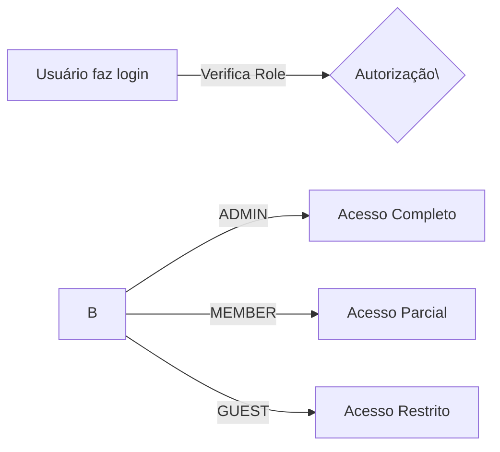
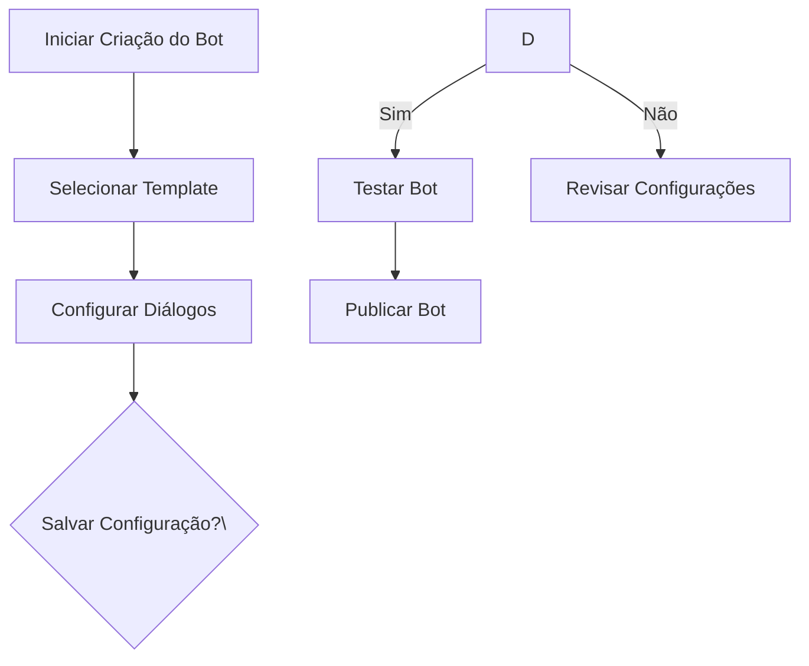
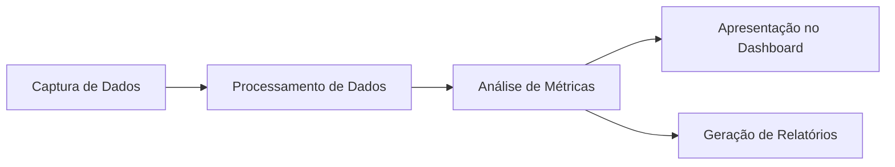

# Documentação funcional

## Visão geral das funcionalidades
O Chat Bot Builder Client é uma aplicação projetada para facilitar a criação, configuração e gestão de chatbots. Esta plataforma permite aos usuários definir interações automatizadas que podem ser integradas em sites ou sistemas de comunicação. A aplicação oferece uma interface intuitiva, integrações com diversos serviços e fornece ferramentas para monitoramento e análise de performance dos bots.

## Funcionalidade 1: Gerenciamento de Usuários
### Descrição
A funcionalidade de Gerenciamento de Usuários permite controlar o acesso e as permissões dos usuários dentro da plataforma. Com base no papel do usuário, diferentes níveis de acesso às funcionalidades são concedidos.

### Telas e Funcionalidades Envolvidas
- **Dashboard de Usuários**: Visualização dos usuários registrados.
- **Definição de Papéis**: ADMIN, MEMBER e GUEST.
- **Controles de Acesso**: Sistema de permissões baseado em papéis.

### Permissões
- **ADMIN**: Acesso total à plataforma, incluindo modificações críticas.
- **MEMBER**: Acesso a funcionalidades principais sem permissões administrativas.
- **GUEST**: Acesso limitado para visualização.

### Diagrama de Fluxo de Usuários


## Funcionalidade 2: Criação de Chatbots
### Descrição
Ferramenta para criar chatbots personalizados usando uma interface gráfica intuitiva. Permite a definição de diálogos e comportamento automatizado.

### Telas e Funcionalidades Envolvidas
- **Editor de Bot**: Interface para montagem das interações.
- **Biblioteca de Recursos**: Importação de elementos como ícones e templates.
- **Simulador de Chat**: Testa o comportamento do bot em diferentes cenários.

### Regras de Negócio
- As configurações devem ser salvas antes de serem publicadas.
- Os bots não publicados não estarão disponíveis para interação pública.

### Diagrama de Criação de Bot


## Funcionalidade 3: Análise de Performance
### Descrição
Proporciona ferramentas analíticas para monitorar o desempenho dos chatbots, permitindo a otimização contínua.

### Telas e Funcionalidades Envolvidas
- **Dashboard de Análise**: Visualização de métricas como interações, respostas e satisfação.
- **Relatórios Detalhados**: Download de relatórios de performance.

### Regras de Negócio
- Dados analíticos são atualizados em tempo real para usuários com permissão adequada.

### Diagrama de Análise de Performance


## Regras de negócios
### Gerenciamento de Usuários
- **ADMIN** tem controle total.
- **MEMBER** pode modificar mas não gerenciar usuários.
- **GUEST** apenas visualiza dados públicos.

### Criação de Chatbots
- Bots devem passar por um controle de qualidade antes da publicação.
- Modificações críticas requerem revisão.

### Análise de Performance
- Somente usuários com permissões específicas podem acessar relatórios completos.

## Diagrama de C4 Arquitetura

### Nível 1: Diagrama de Contexto
```mermaid
C4Context
title Contexto do Sistema para Chat Bot Builder Client
Enterprise_Boundary(b0, "Boundary") \{
    Person(user, "Usuário", "Usuário que utiliza a platforma.")
    System(chatbotClient, "Chat Bot Builder Client", "Permite criação e gerenciamento de chatbots.")

    System_Ext(externalService, "Serviço Externo", "Serviços como integração com Google Drive, etc.")

    BiRel(user, chatbotClient, "Usa")
    BiRel(chatbotClient, externalService, "Integra")
\}
```

### Nível 2: Diagrama de Contêiner
```mermaid
C4Container
title Contêiner para Chat Bot Builder Client
System_Boundary(c1, "Chat Bot Builder Client") \{
    Container(webApp, "Web Application", "React + NextJS", "Interface do usuário para criação de bots.")
    Container(api, "API", "NodeJS", "Backend que processa lógica do negócio.")
    Container_Db(db, "Database", "SQL", "Armazena dados de configuração.")

    Rel(user, webApp, "Usa", "HTTPS")
    Rel(webApp, api, "Consultas", "HTTPS/JSON")
    Rel_Back(api, db, "Lê e escreve", "JDBC")
\}
```

Esta documentação fornece uma visão geral clara das funcionalidades, arquitetura e regras de negócios do Chat Bot Builder Client, facilitando a compreensão para equipes técnicas e não técnicas.

## Instalação

Made with [Nestjs](https://docs.nestjs.com)

```bash
$ npm install
```

## Executando o aplicativo

```bash
# create .env file
cp .env.example .env

# development
$ npm run start

# watch mode
$ npm run start:dev

# production mode
$ npm run start:prod
```

## Teste

```bash
# unit tests
$ npm run test

# e2e tests
$ npm run test:e2e

# test coverage
$ npm run test:cov
```

[](https://github.com/semantic-release/semantic-release)

## Publicação

Após a implantação, certifique-se de que todos os métodos alterados estejam refletidos na documentação README.

Url: https://dash.readme.com/
Staging: tech+staging@octadesk.com
Prd: tech@octadesk.com

As senhas estão no Keeper.

Acesse-o e vá para Api Reference no menu lateral. No topo da nova janela, clique em resync.

Para validar, acesse a documentação e vá para o exemplo no método que você alterou.

