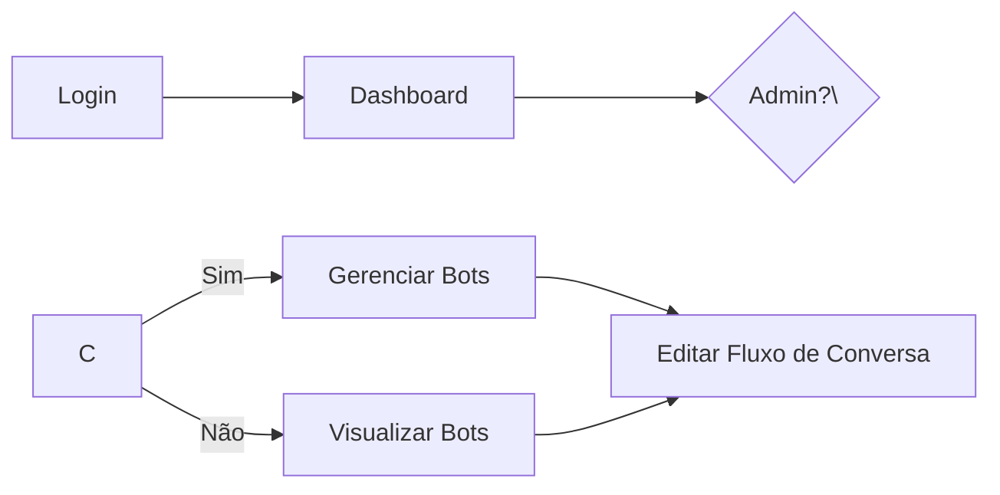
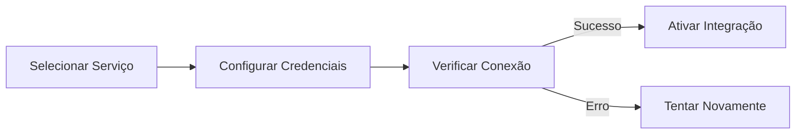
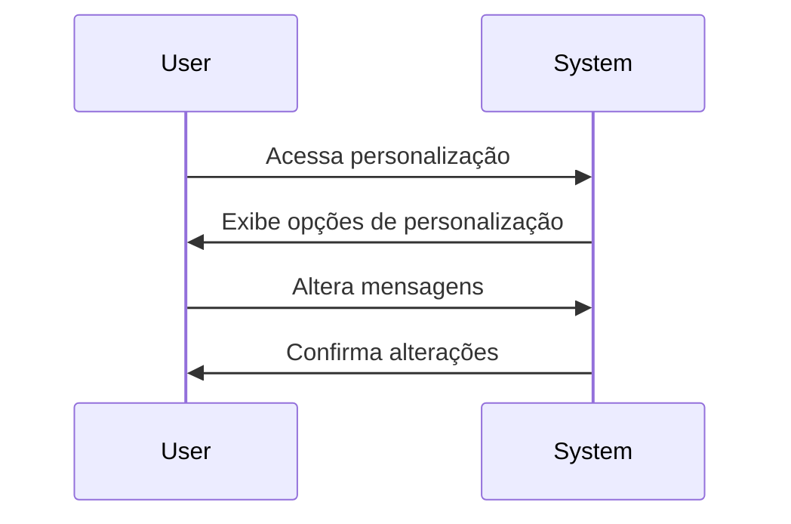

# Documentação funcional

## Visão geral das funcionalidades
O Chat Bot Builder Client é uma aplicação projetada para criar, gerenciar e personalizar bots de conversação. Este sistema é voltado para empresas que desejam implementar assistentes virtuais automatizados para melhorar a interação com seus clientes. A aplicação permite a configuração de bots com regras personalizadas, integração com serviços externos e a personalização de interações específicas. Permissões de usuário garantem que diferentes níveis de acesso sejam respeitados, assegurando a segurança e a privacidade dos dados.

## Funcionalidade 1: Gerenciamento de Bots
### Descrição
A aplicação permite que os usuários criem e gerenciem bots de conversação. Os usuários podem definir fluxos de conversa, personalizar mensagens, e configurar respostas automáticas.

### Permissões
- **Admin**: Pode criar, editar e excluir bots.
- **Member**: Pode visualizar e editar bots.
- **Guest**: Apenas visualização.

### Diagrama de funcionalidades


## Funcionalidade 2: Integração com Serviços Externos
### Descrição
Os usuários podem integrar seus bots com serviços externos, como Google Drive, Slack, etc., para armazenar dados ou enviar notificações.

### Permissões
- **Admin**: Pode configurar integrações.
- **Member**: Pode ver configurações de integração.

### Diagrama de fluxo de integração


## Funcionalidade 3: Personalização de Mensagens
### Descrição
Os usuários podem personalizar as mensagens que serão enviadas aos clientes, incluindo o uso de variáveis dinâmicas.

### Permissões
- **Admin**: Total acesso para editar mensagens.
- **Member**: Pode personalizar mensagens em bots existentes.

### Diagrama de sequência de personalização


## Regras de negócios
- **Criação de Bots**: Antes de criar um bot, é obrigatório que o usuário informe um nome e uma descrição. O sistema verifica se o nome já está em uso.
- **Integrações**: As credenciais de integração devem ser verificadas antes da ativação. Unidades que falharem nesta verificação não poderão ser ativadas.
- **Alteração de Mensagens**: Todas as alterações de mensagens são versionadas para garantir a reversão em caso de erros.
- **Permissões de Acesso**: Usuários devem ser autenticados antes de executar qualquer ação no sistema.

### Exemplo de tratamento de erros
- **Erro na Integração**: Se a integração falhar, uma mensagem especificando o erro será mostrada ao usuário, que deverá revisar suas configurações.

## Diagrama C4 - Nível 1: Contexto do Sistema
```mermaid
C4Context
title System Context diagram for Chat Bot Builder Client

Enterprise_Boundary(b0, "ChatBotClientBoundary") \{
  Person(admin, "Admin User", "Gere todos os aspectos dos bots.")
  Person(member, "Member User", "Interage com funcionalidades limitadas dos bots.")
  
  System(SystemAA, "Chat Bot Builder Client", "Plataforma para criar e gerenciar chatbots.")
  
  Enterprise_Boundary(b1, "ExternalServices") \{
    System_Ext(ExternalService, "Google Drive", "Armazenamento de dados do bot.")
  \}
\}

Rel(admin, SystemAA, "Gerencia")
Rel(member, SystemAA, "Visualiza/Interage")
Rel(SystemAA, ExternalService, "Integração")
```

## Diagrama C4 - Nível 2: Contêiner
```mermaid
C4Container
title Container diagram for Chat Bot Builder Client

System_Boundary(c1, "Chat Bot Builder Client") \{
  Container(web_app, "Web Application", "React", "Interface de usuário para configuração de bots")
  Container(api, "Backend API", "Node.js", "Lida com a lógica de negócios e acessos ao sistema.")
  ContainerDb(database, "SQL Database", "Armazena informações dos bots e configurações do usuário.")
\}

System_Ext(externalService, "Google Drive", "Serviço de armazenamento externo.")
Person(user, "User", "Usuário que interage com a aplicação.")

Rel(user, web_app, "Usa", "HTTPS")
Rel(web_app, api, "Comunica com", "JSON/HTTPS")
Rel(api, database, "Le/escreve para", "SQL")
Rel(api, externalService, "Integra com", "REST API")
```

---

Esta documentação fornece uma visão geral funcional do Chat Bot Builder Client, facilitando o entendimento para equipes técnicas e não técnicas sobre as funcionalidades, permissões, regras de negócios, e arquitetura da aplicação.

## Instalação

Made with [Nestjs](https://docs.nestjs.com)

```bash
$ npm install
```

## Executando o aplicativo

```bash
# create .env file
cp .env.example .env

# development
$ npm run start

# watch mode
$ npm run start:dev

# production mode
$ npm run start:prod
```

## Teste

```bash
# unit tests
$ npm run test

# e2e tests
$ npm run test:e2e

# test coverage
$ npm run test:cov
```

[](https://github.com/semantic-release/semantic-release)

## Publicação

Após a implantação, certifique-se de que todos os métodos alterados estejam refletidos na documentação README.

Url: https://dash.readme.com/
Staging: tech+staging@octadesk.com
Prd: tech@octadesk.com

As senhas estão no Keeper.

Acesse-o e vá para Api Reference no menu lateral. No topo da nova janela, clique em resync.

Para validar, acesse a documentação e vá para o exemplo no método que você alterou.

